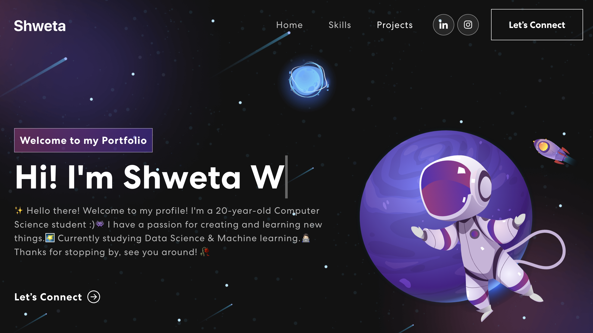

# Personal_portfolio
## Steps to Run the React App :

### 1)Open a Folder of the Project 
### 2)Open the terminal for that project folder 
### 3) Run the Command :  `npm install`
### 3) Run the Command :  `npm start`
